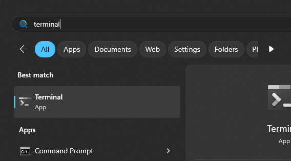
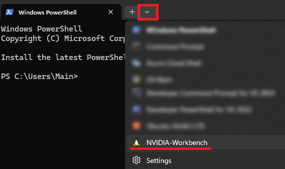
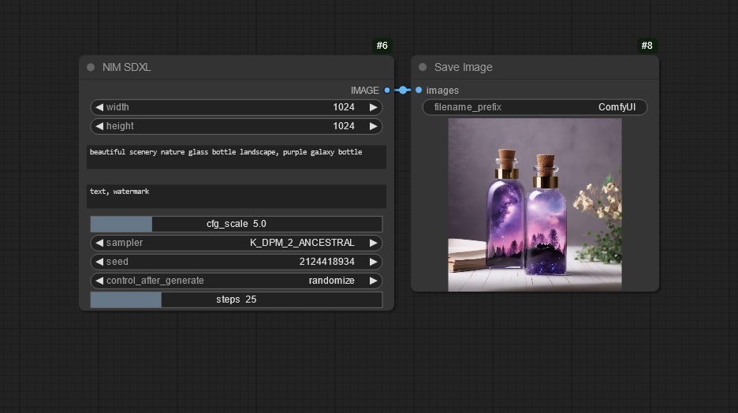

# NVIDIA NIM SDXL 

### What is Stable Diffusion XL NIM?

The Stable Diffusion XL NIM is a container that allows you to run Stability.AI’s Stable Diffusion XL model - one of the most popular visual generative AI models in the world - in the most optimal manner. 

## Getting Started with Stable Diffusion XL NIM with ComfyUI

Before installing, ensure your system meets the following requirements:  
Operating System: Windows 11 (22H1 or later)  
GPU: AD100 or above  
GPU Driver: Version 565.xx or later  
Virtualization Settings: Enabled in SBIOS - [Instructions to enable virtualization if it is not enabled](https://support.microsoft.com/en-gb/windows/enable-virtualization-on-windows-c5578302-6e43-4b4b-a449-8ced115f58e1)


The node can automatically download and run the NVIDIA NIM installer for you when you install the node via ComfyUI Manager.  
Alternatively you can download and run the the installer from here:  
https://storage.googleapis.com/comfy-assets/NimSetup.exe

After NIM is installed (via automatic process or manual - note that these steps will be streamlined in future), please perform the following steps:

1. Open the Terminal app  
  
2. Open the NVIDIA-Workbench profile by clicking on the arrow along the top  

3. Setup NIM directories by running the following commands
```
export LOCAL_NIM_CACHE=~/.cache/nim
mkdir -p "$LOCAL_NIM_CACHE"
chmod -R a+w "$LOCAL_NIM_CACHE"
```

### Install node in ComfyUI
The recommended way to install these nodes is to use the [ComfyUI Manager](https://github.com/ltdrdata/ComfyUI-Manager) to easily install them to your ComfyUI instance.  
You can also manually install them by git cloning the repo to your ComfyUI/custom_nodes folder

## Usage
You will need to start the container each time you want to use the node.  
To do this, navigate to the NVIDIA-Workbench profile in Terminal (see getting started section) and run the following command:
```
podman run -it --rm \
 --device=nvidia.com/gpu=all \
 --shm-size=16GB \
 -e NGC_API_KEY=$NGC_API_KEY \
 -v "$LOCAL_NIM_CACHE:/opt/nim/.cache" \
 -u $(id -u) \
 -p 8000:8000 \
 {todo: URL}
 ```
 The first time you run this it will download and configure the container, this may take a while.
 
After the container is running you can then simply add the NIM SDXL node to generate images, download the [example workflow here](example_workflows/workflow.json) or you can drag the image below into ComfyUI to view the embedded workflow:
  
