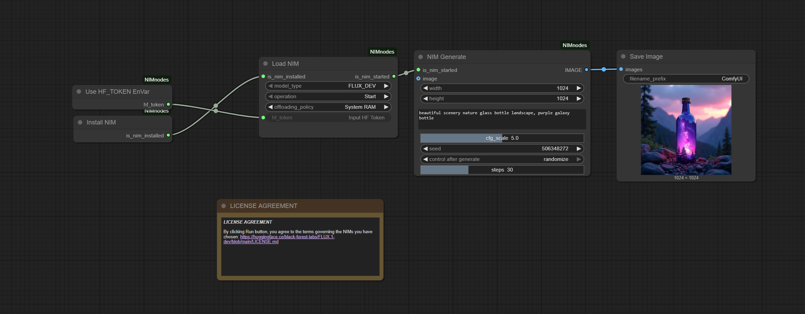
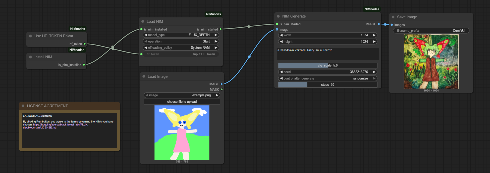
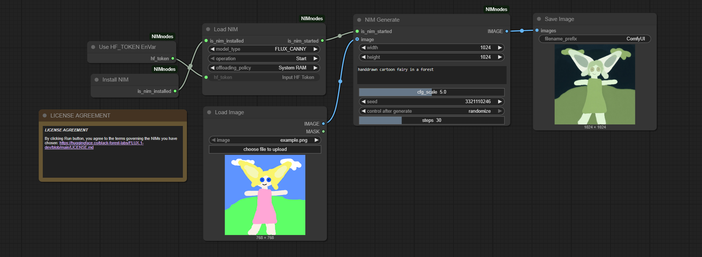
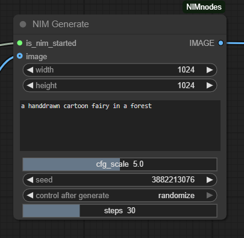

# NVIDIA FLUX NIM

### What is the FLUX NIM?

The FLUX NIM is an NVIDIA Microservices container designed to run Black Forest Lab's FLUX models in the most optimal manner. This NIM provides support for the following models from Black Forest Lab's:  Flux.1 dev, Flux.1-Depth-dev, and Flux.1-Canny-dev. 

## Getting Started with the FLUX NIM in ComfyUI

Before installing, ensure your system meets the following requirements:  
Operating System: Windows 11 (22H1 or later)  
GPU: RTX 5090, RTX 5080, RTX 4090, RTX 4090 Laptop, RTX 4080, RTX 6000 Ada 
GPU Driver: Version 572.83 or later  
Virtualization Settings: Enabled in SBIOS - [Instructions to enable virtualization if it is not enabled](https://support.microsoft.com/en-gb/windows/enable-virtualization-on-windows-c5578302-6e43-4b4b-a449-8ced115f58e1)

The node can automatically detect if you have already set up NVIDIA NIM, if not, it will navigate to the NIMsetup.exe download page where you can download and install NIMs.  
However it is recommended to installer from [here](https://assets.ngc.nvidia.com/products/api-catalog/rtx/NIM_Prerequisites_Installer_03052025.zip) unzip the downloaded file and run NIMSetup.exe. 

After the NIM setup has completed, please perform the following steps to start NIMs in Comfy UI:

1. Install ComfyUI following [this](https://github.com/comfyanonymous/ComfyUI?tab=readme-ov-file#installing) note the special instructions for installing for NVIDIA 50-Series (Blackwell) and prepare the running enviorment for ComfyUI
2. Open ComfyUI folder, clone this repo and put it under `...\ComfyUI\custom_nodes\`
3. Go to `...\ComfyUI\custom_nodes\comfyui_nim\`and install dependency with `pip install -r requirements.txt`
4. If using the windows standalone ComfyUI install use this command `..\..\..\python_embeded\python -m pip install -r requirements.txt`
5. A HuggingFace API token is required to access the Flux models. For information on how to create an access token see [here](https://huggingface.co/docs/hub/en/security-tokens)
6. To avoid having to input your token into the NIM everytime you can set the HF_TOKEN environment variable.
7. Open a command prompt and type `setx HF_TOKEN <hftoken_info>` where <hftoken_info> represents your actual Hugging Face Token string.
8. Run ComfyUI APP with `python main.py` under `...\ComfyUI\`
9. For ComfyUI standalone, run ComfyUI using the run_nvidia_gpu.bat file. 
10. Open ComfyUI in browser, and import workflow `...\ComfyUI\custom_nodes\comfyui_nim\example_workflows\FLUX_Dev_NIM_Workflow.json`
11. Run the workflow. *The first time you run this it will download and configure the container, this may take a while.*
12. 
13. 
14.  
15. When ComfyUI is shutdown, the running NIMs will also be stopped  

### Install node in ComfyUI
The recommended way to install these nodes is to use the [ComfyUI Manager](https://github.com/ltdrdata/ComfyUI-Manager) to easily install them to your ComfyUI instance.  
You can also manually install them by git cloning the repo to your ComfyUI/custom_nodes folder.

### Node Details

The **Install NIM Node** checks to verify that the NIMs have been setup on the system, if the NIM setup has been completed this node returns *TRUE*. If NIM setup has not be completed, this node returns *FALSE* and will download the NIMSetup package.

This node must be connected to the **is_nim_installed** input on the Load NIM Node

The **Load NIM Node** is responsible for loading the requested NIM. 

Inputs:

*model_type*: [Flux Dev, Flux Canny, or Flux Depth] Determines which Flux model is loaded.

*operation*: [Start, Stop]. **Start** is used to load and start the requested model in the NIM.  **Stop** will stop the NIM and unload loaded models, when switching between NIM models, any running models should be stopped before starting a new model.

*offloading_policy*: [None, System RAM, Disk]. The offloading policy determine how models should be offloaded from VRAM.

**None** indicates that models will not be offloaded, if the models exceed the available VRAM then generation will fail, it is recommended to only use **None** on GPUs with 24GB or more VRAM. If supported by the GPU, **None** offers the best performance.

**System RAM** will move models to System RAM. The **System RAM** option provides a good mix of performance and flexibility, but may not be the best option for systems with limited system RAM.

**Disk** will move offloaded models to disk. Offloading to disk impacts the overall performance but provides a viable option for GPUs with less than 24GB on systems with limited system RAM.

*hf_token*: This field is used to provide the users Hugging Face API token, it is recommended to store the Hugging Face API token to the HF_TOKEN environment variable and use the Use **HF_TOKEN EnVar Node** to provide this input. *This field is required and must provide a valid HF API Token*.

*is_nim_installed*: This input takes the output from the **Install NIM Node** is_nim_install output.

Outputs:

*is_nim_started*: This output sends information on whether the NIM has been started and is ready to recieved input. If the NIM has started and is ready it will return **True**. If the NIM fails to start it will return **False**.

The **NIM FLUX NODE** allows the user to configure the options used by the FLUX NIM to generate images.

Inputs:

*image*: When the FLUX Canny or FLUX Depth models are used, an image needs to be used to guide the image output. The Image input takes regular images as input and will be converted to *Depth* or *Canny* images within the NIM. 

*is_nim_started*: This input takes the output from the **is_nim_started** output from the *Load NIM Node*.

*width*: The image width. Valid ranges are "768", "832", "896", "960", "1024", "1088", "1152", "1216", "1280", "1344"

*height*: The image height. Valid ranges are "768", "832", "896", "960", "1024", "1088", "1152", "1216", "1280", "1344"

*prompt*: The text description of the desired image output

*cfg_scale*: The cfg scale determines how closely the output adheres to the prompt input, higher values will cause more adherence. 

*seed*: The seed used for noise generation.

*control after generate*: [fixed, increment, decrement, randomize]

*steps*: The number of generation steps used per image.

Output:

*image*: The generated image, this output should be connected to a Preview Image Node or Save Image Node.

The **Use HF_TOKEN Node** willread the HF_TOKEN environment variable and pass it as an output which can be connected to the **hf_token** input on the *Load NIM Node*

Inputs:

NONE

Output:

*hf_token*: Outputs the contents of the HF_TOKEN environment variable, will generate a failure if the environment variable does not exist.
